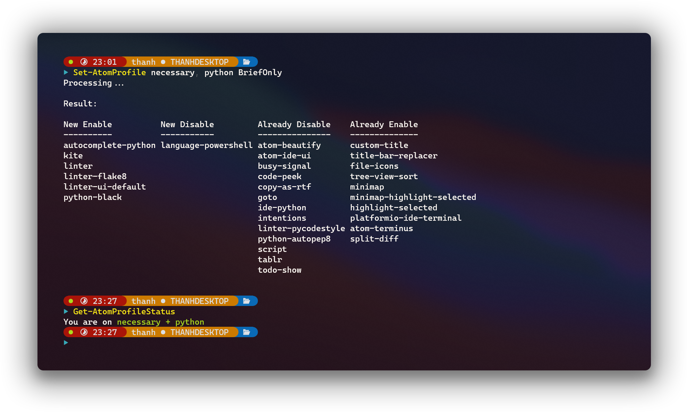

# `Set-AtomProfile.ps1`


## Introduction

A PowerShell script for switching between profiles in [atom editor](http://atom.io/).


## Usage

### Step 1: Prepare profile files containing lists of packages.

Create files in the `Profiles` folder containing packages separated by lines (blank lines are allowed).

### Step 2: Import module

Import the module by using directly this command or put it in [a PowerShell profile](https://docs.microsoft.com/en-us/powershell/module/microsoft.powershell.core/about/about_profiles).

``` powershell
PS> Import-Module Set-AtomProfile.psm1
```

### Step 3: Run command

- `Set-AtomProfile`:

``` powershell
PS> Set-AtomProfile [-ProfileNames] <String[]> [[-OutputMode] {BriefOnly | Everything | Nothing}]
```
The command will enable all packages in the profile files specified in the `ProfileNames` parameter. The rest of the installed packages will be disabled. Results will be printed in three modes: `BriefOnly` (final result only), `Everything` (process and final result) or `Nothing` (no messages).

`ProfileNames` can take `All` or `Nothing` value.

- `Get-AtomProfileStatus`:

```powershell
PS> Get-AtomProfile
```
The command will show the current profile being set.


## Example

In file `Profiles\necessary`:

``` text
custom-title
title-bar-replacer

file-icons
tree-view-sort

minimap
minimap-highlight-selected
highlight-selected

platformio-ide-terminal
atom-terminus

split-diff
```

In file `Profiles\python`:
``` text
autocomplete-python
kite

linter
linter-flake8
linter-ui-default

python-black
```

``` powershell
PS> Set-AtomProfile necessary, python BriefOnly
Processing...

Result:

New Enable          New Disable         Already Disable    Already Enable
----------          -----------         ---------------    --------------
autocomplete-python language-powershell atom-beautify      custom-title
kite                                    atom-ide-ui        title-bar-replacer
linter                                  busy-signal        file-icons
linter-flake8                           code-peek          tree-view-sort
linter-ui-default                       copy-as-rtf        minimap
python-black                            goto               minimap-highlight-selected
                                        ide-python         highlight-selected
                                        intentions         platformio-ide-terminal
                                        linter-pycodestyle atom-terminus
                                        python-autopep8    split-diff
                                        script
                                        tablr
                                        todo-show
```

``` powershell
PS> Get-AtomProfileStatus
You are on necessary + python
```

